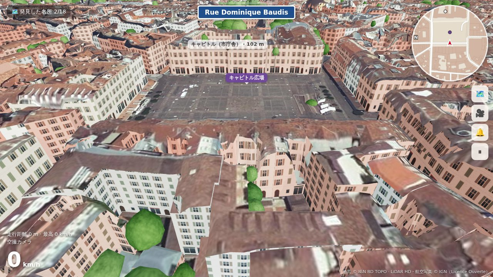
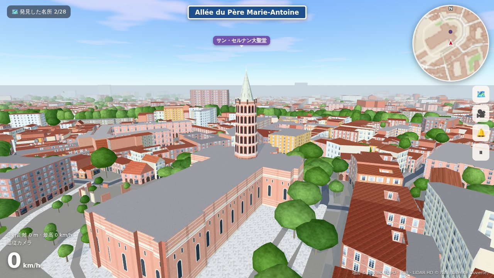
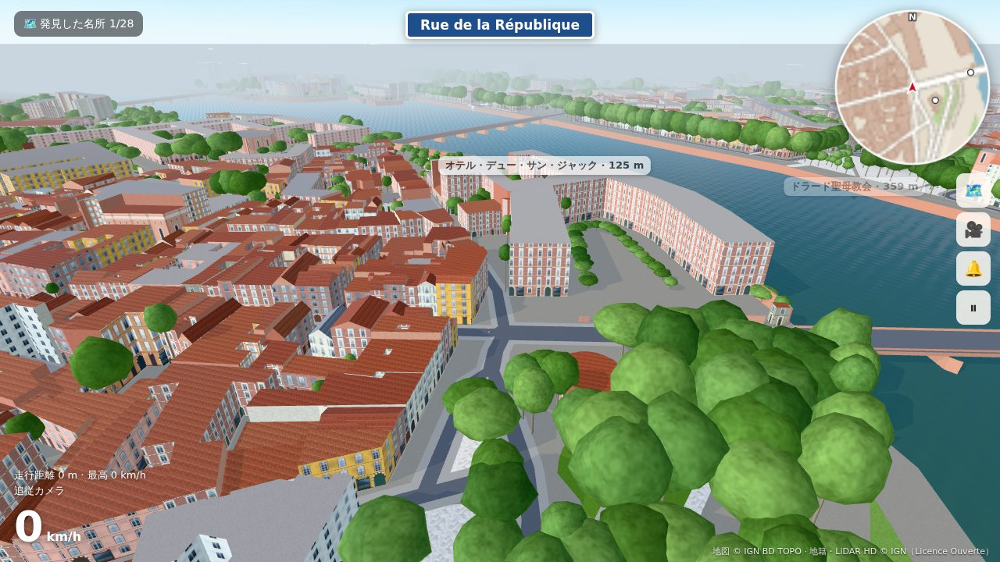
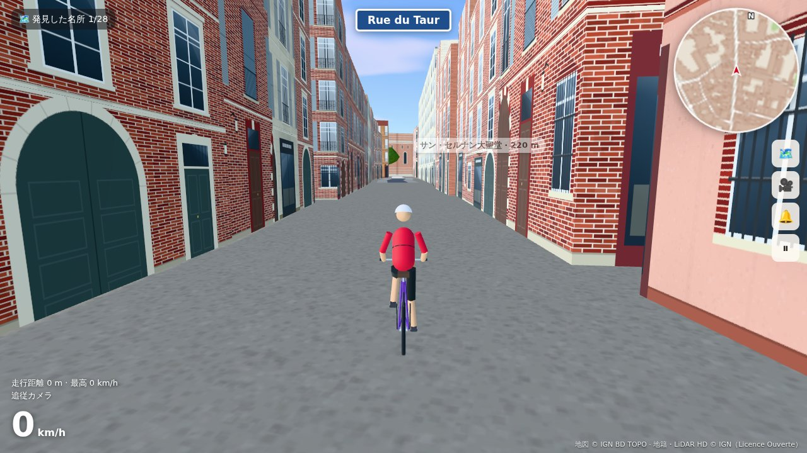
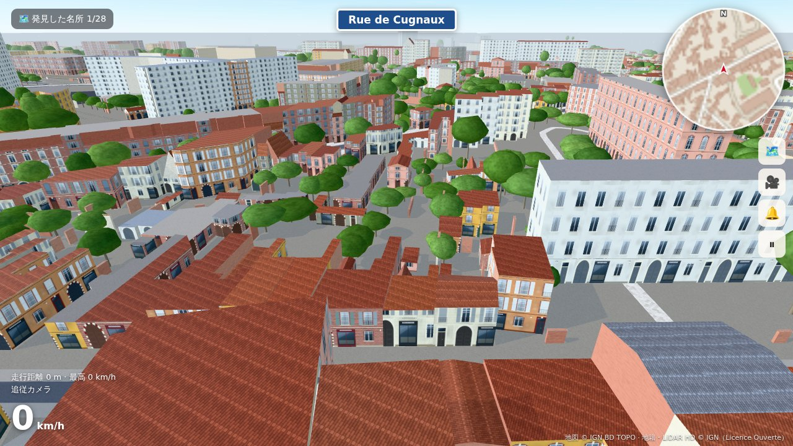
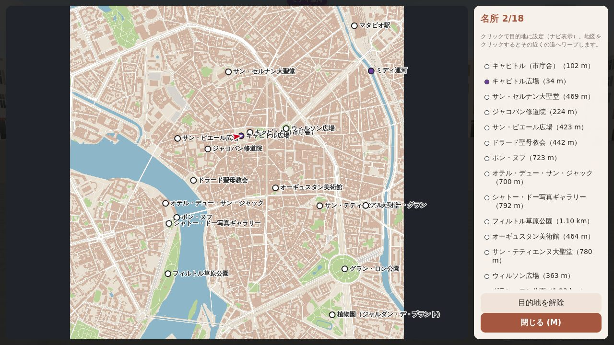

# Toulouse à vélo — トゥールーズ自転車散歩

実在のフランス・トゥールーズの街を 3D で再現し、自転車で自由に走り回れるブラウザゲームです。
建物・通り・川・橋・公園は実際の地図データ（OpenStreetMap と IGN BD TOPO）から自動生成しています。
敷地を隔てる塀と木は、IGN（フランス国土地理院）の地籍図（敷地の境界）と、航空機からレーザーで測った **LiDAR HD** の高さデータから、
実際にある場所に置いています。API キーや登録は要りません。

|  |  |
| --- | --- |
| キャピトル広場から市庁舎（キャピトル）を見る。正面は専用に描いたファサード | サン・セルナン大聖堂の八角形の鐘楼（半円アーチ 3 層・ミトラ形アーチ 2 層・石の尖塔）。写真を手本に、LiDAR で測った高さで作ったモデル |
|  |  |
| オテル・デュー・サン・ジャックの中庭。生け垣のように刈り込んだ木の列も LiDAR で見つけた本物の位置 | サン・セルナン大聖堂へ続く Rue du Taur。レンガに石の窓枠、漆喰の家、馬車門、鉄格子の窓 |
|  |  |
| サン・シプリアンの住宅街。庭や中庭を囲むレンガの塀と、庭の木 | 全体地図（名所を選ぶとナビ、地図をクリックでワープ） |

※ ソフトウェア描画の開発環境で撮影したため、実際のブラウザではもっとなめらかです。

## エリア

| エリア | 範囲 | 読み込み方 |
| --- | --- | --- |
| **トゥールーズ全体**（標準） | ポン・ヌフから半径 5 km（10 km 四方、建物 13 万棟・塀 13 万か所・木 26 万本）。旧市街に加えて、西のパーパン（病院・ローマ円形闘技場）、サン・シプリアン、ミニム、ランギュイユ、東のシテ・ド・レスパスまで | 自転車の周り（約 650 m）だけを作り、走るにつれて読み込む。遠くは霧に溶ける |
| 旧市街 | キャピトル広場から半径 1.2 km | まとめて読み込む |
| 軽量 | キャピトル周辺の半径 0.7 km | 古い PC・スマホ向け |

**トゥールーズ全体のしくみ**: エリアを 500 m 四方のタイル（420 枚）に分けます。
- 道路・川・公園・名所はエリア全体を最初に読み込むので、ナビ・地図・通りの名前はどこでも使えます。
- 建物・塀・木・道路の面は、自転車の近くのタイルだけを組み立て、離れたら捨てます。読み込みが間に合わないときは、その場で少し待ちます。
- タイルのファイルには、隣のタイルの境近くの建物も入れてあり、タイルの境でも隣の建物と接する壁を正しく扱えます。

## 遊び方

| 操作 | キーボード | ゲームパッド | スマホ |
| --- | --- | --- | --- |
| こぐ | `W` / `↑` | RT / A | 「こぐ」 |
| ブレーキ（止まっているときは後退） | `S` / `↓` | LT / B | 「ブレーキ」 |
| ハンドル | `A` `D` / `←` `→` | 左スティック | ◀ ▶ |
| 立ちこぎ（加速） | `Shift` | RB | — |
| ベル | `Space` | X | 🔔 |
| カメラ切替（追従 / 一人称 / 上空 / 空撮） | `C` | Y | 🎥 |
| 地図・目的地選択・ワープ | `M` / `Tab` | Back | 🗺️ |
| 道路に戻る | `R` | — | — |
| ポーズ | `Esc` / `P` | Start | ⏸ |

- **自由走行**: 街を走って名所（キャピトル、サン・セルナン大聖堂、ポン・ヌフ、ミディ運河など 18 か所）を発見します。地図で名所を選ぶと、実際の道路網でルートを計算してナビします。
- **名所めぐりタイムアタック**: キャピトル広場をスタートし、名所を順番に回ってタイムを競います（自己ベストを保存）。
- 画面上部には今走っている**実際の通りの名前**が表示されます。

## 「正確な再現」のしくみ

地図データは 2 つの公開データから取得します。

1. **OpenStreetMap**（Overpass API）＋ **IGN BD TOPO の実測の建物の高さ** … 通常はこちら
2. **IGN BD TOPO だけ** … OpenStreetMap のサーバー（Overpass API）が混んでいてつながらないと自動でこちらに切り替わります。タイトル画面の「グラフィック設定」で最初から選ぶこともできます（トゥールーズ全体は IGN だけ）

IGN（フランス国土地理院）の BD TOPO は、建物の軒の高さ・屋根の高さ・壁や屋根の材料（レンガ・石・コンクリート／瓦・スレート）、道路の幅・正式な通り名・橋・歩行者専用道まで持っている公的なデータです。

| 要素 | データ | 再現方法 |
| --- | --- | --- |
| 建物の形 | OSM（フランスの地籍図由来）または IGN | 外形を押し出して 3D 化。中庭（穴）、`building:part`（鐘楼など）にも対応 |
| 建物の高さ | ① OSM の `height` → ② **IGN の実測の高さ** → ③ OSM の階数 → ④ 推定 | IGN は航空写真測量による実測値（IGN で組み立てた旧市街エリアでは 12,307 棟中 99.7% が実測） |
| 屋根 | OSM の `roof:shape`、IGN の屋根の最高点・最低点 | 四角形の建物は実際の屋根の高さで切妻・寄棟に。それ以外は屋根の中間の高さの陸屋根 |
| 壁（ファサード） | IGN の壁の材料（レンガ・石・コンクリート） | 実際の街並みの写真を手本にした 9 つの様式から材料に合わせて選ぶ: 薄いレンガ（brique foraine）に白い石の窓枠、レンガに木の鎧戸と鉄の手すり、彩度を抑えた黄土色・灰褐色・サーモン色・ばら色の漆喰にレンガの窓枠（レンガと石の交互積み）、クリーム色の切り石、現代的な建物、キャピトル広場を囲むアーケードのレンガ造り。旧市街（`config.js` の `OLD_TOWN`）のレンガ造り・材料不明の建物は 8 割がレンガの様式。窓台からの雨だれ、足元の暗い腰壁（約 0.8 m）、軒下と壁際の地面の陰で古びた感じを出す。1 階は馬車門・店・鉄格子の窓・玄関・壁付けの角灯。窓は壁の辺の中央にそろえ、最上階の窓が軒で切れないよう階の高さを調整。オテル・デュー・ラ・グラーヴ病院はレンガに石の窓枠 |
| 隣と接する壁 | 隣の建物の外形と高さ | 隣の建物と 0.8 m 以内で平行に並ぶ壁は、隣の高さまでは作らず（隠れるので）、それより上は窓のない壁（境界の壁）にする |
| 敷地を隔てる塀 | IGN の地籍（Parcellaire Express の敷地の境界）＋ LiDAR HD の表面モデル（0.5 m 格子）と地形モデル | 敷地の境界に沿って 0.5 m ごとに地面からの高さを調べ、「高さ 1.6〜7 m で、両側 1〜1.5 m より 1 m 以上高い、細い盛り上がり」が 2 m 以上続く所を塀にする。建物の上・木（両側も高い）・車（低い）は除き、1 m 以下のすき間はつなぐ（門などの開口は残る）。位置は境界から前後 1.25 m の範囲で実際に高い所へずらし、高さも実測。道路の上にかかる部分は切り取る。レンガ（ときどき漆喰）の壁に瓦の笠木 |
| 木 | LiDAR HD の表面モデル − 地形モデル（樹冠の高さ） | 樹冠の頂点を探し、本物の位置・高さ・枝の広がりで木を置く（トゥールーズ全体で約 26 万本）。樹冠は高さに見合った大きさに抑え（平たい板にしない）、横に広い低い塊は 2〜3 本に分ける。樹冠は木ごとに違うこぶのある形、幹は途中で二股。街路・運河・河岸の木はまだらな樹皮のプラタナス。建物の上・水の上・道路の真ん中は除く。LiDAR がないエリアでは、公園に木を補い、並木道（Allées・Boulevard など）に木を植える |
| キャピトル | 広場に面した建物の壁 | 専用の正面: 1 階はレンガと白い石の縞、2 階はばら色のレンガに白い付け柱、中央に 8 本のばら色の大理石の円柱と「CAPITOLIUM」の破風、屋上の手すりと壺 |
| 教会 | IGN の建物の種類（教会） | 南仏のレンガの教会の壁（白い石の帯・控え壁・半円アーチの高窓・軒下の小窓） |
| 鐘楼 | LiDAR HD で測った尖塔の位置・高さ・鐘楼の太さ・付け根の高さ | サン・セルナン（半円アーチ 3 層＋ミトラ形アーチ 2 層・小塔の冠・石の尖塔、高さ 67 m）とジャコバン（ミトラ形アーチ 4 層、46 m）の八角形の鐘楼を、写真を手本にモデルで作る |
| 屋根の色 | OSM の `roof:colour` など、IGN の屋根の材料 | 瓦・スレート・亜鉛などの色 |
| 道路 | OSM の `highway`、IGN の道路の種類・幅・通り名 | 車道・歩道・歩行者専用道（石畳）・自転車道を描き分け、実際の通り名を表示。車道の端には花崗岩の縁石と側溝 |
| 質感 | Wikimedia Commons のトゥールーズの写真（手本として見るだけで、画像は使っていない） | レンガ: 長さ約 36 cm・厚さ約 5 cm の薄いレンガ（brique foraine）に太い砂色の目地、縦目地は不規則、焼きムラ。塀は地面際の湿気と雨だれ、漆喰の塀ははがれた所からレンガがのぞく。屋根: 丸瓦（tuile canal）の山と谷、瓦ごとの焼き色の違いと苔。車道: 骨材の粒・ひび割れ・補修跡のあるアスファルト。歩行者専用の通り: 淡いベージュの石の板を段ごとにずらして敷いたもの |
| 川・運河 | 水域ポリゴン | ガロンヌ川は約 6 m 下を流れ、レンガの河岸の壁で囲まれる。水はにごったオリーブ色の灰緑（運河は暗い緑）で、弱い波を 2 枚重ねて流し、空は斜めから見たときだけ映る。岸壁の際は暗い。橋だけ渡れる（橋の下で切り抜かれた水面は埋め直す） |
| 光と空 | — | 暖色の太陽（影を落とす）と、空の青・レンガの照り返しの半球光、弱い環境光（空のシェーダーから明るさを測って強さを決める）。地平線のもやと霧は灰色がかったばら色で、遠くの街並みが空に溶ける |
| 通路 | 道路が建物の外形を横切る箇所 | 建物の下をくぐる通路として通れるようにする |

塀と木は地図データの事前取得（`npm run fetch-data`）のときに見つけて、同梱データに入れておきます。
同梱データのないタイルは、ゲームが IGN から地籍と LiDAR を取得してその場で見つけます（1 タイル約 5 MB）。

ゲーム中に `Esc` でポーズすると、建物の高さが「IGN 実測 / OSM / 推定」のどれから来たかの内訳や、塀と木の数が見られます。

### 既知の限界

- 窓・扉は実際の街並みを手本に手続き的に描いた様式です。建物ごとの本当の窓の配置や色ではありません（キャピトルの正面だけは専用）。教会などのモニュメントの装飾は再現されません。
- 地形（標高差）は再現していません。地面は平らで、ガロンヌ川だけ低くなっています。
- 塀は「敷地の境界の上にあるもの」だけです。敷地の中の塀や、木に覆われた塀、低い塀（1.6 m 未満）は見つかりません。生け垣が塀になることもあります。
- 橋は平らな橋面と橋脚です（アーチは再現していません）。
- 遠くの街並み（約 1 km より先）は表示しません。
- 自動車・歩行者はいません。一方通行も無視します（ゲームなので）。
- 再現の精度は元データに依存します。OSM のおかしな箇所は [OpenStreetMap](https://www.openstreetmap.org/) を直すと、次回のデータ取得から反映されます。

## 開発

```bash
cd toulouse-a-velo
npm install
npm run dev          # http://localhost:5173 で起動
```

初回起動時、ブラウザが Overpass API（OSM）と IGN Géoplateforme の WFS から地図データをダウンロードします（30 秒〜数分）。Overpass に 100 秒つながらなければ IGN だけで組み立てます。取得したデータは IndexedDB にキャッシュされ、2 回目以降はすぐに始まります。

### 地図データを同梱する（推奨）

```bash
npm run fetch-data -- toulouse      # トゥールーズ全体 → public/data/toulouse.json（道路など）と
                                    #   public/data/toulouse-tiles/<i>_<j>.json（建物・塀・木、500 m ごと・約 115 MB）
npm run fetch-data -- centre        # 旧市街 → public/data/centre.json（OSM、だめなら IGN）
npm run fetch-data -- all           # すべてのエリア
npm run fetch-data -- centre --ign  # IGN だけで作る（旧市街で約 9 MB、数分）
```

`public/data/` に保存されたデータがあれば、ゲームはそれを最初に使います（ダウンロード待ちなし）。データファイルは大きいので Git には入れていません（GitHub Pages への公開時に自動で取得します）。

### URL パラメータ

| パラメータ | 例 | 説明 |
| --- | --- | --- |
| `area` | `?area=light` | エリアを選んだ状態で開く（`toulouse` / `centre` / `light`） |
| `lat` `lon` `r` | `?lat=43.5615&lon=1.4682&r=800` | 任意の地点を中心にする（トゥールーズ以外の街でも動きます） |
| `mode` | `?mode=tour` | タイムアタックを選んだ状態で開く |
| `autostart` | `?autostart=1` | タイトル画面を飛ばして開始 |
| `refresh` | `?refresh=1` | 同梱データ・キャッシュを使わずに地図データを取得し直す |

### テスト

```bash
npm test                           # 単体テスト（座標変換・OSM/IGN の変換と解析・ルート探索・当たり判定・木・塀・隣と接する壁・タイル）
npm run build && npm run test:e2e  # ブラウザでの通しテスト（合成の地図）
npm run test:autopilot             # 本物の地図で、全名所を自動走行で回れるか（要 fetch-data）
npm run build && node test/e2e-network.mjs  # 本物のネットワークで IGN への自動切り替えを確認
npm run build && NODE_USE_ENV_PROXY=1 node test/real-mode.mjs '[{"name":"a","lm":"saint-sernin","camera":"drone"}]'
                                   # 本物の地図データで開いて指定の場所を撮影（test/output/）。
                                   # AREA=toulouse でトゥールーズ全体（タイルの読み込みも確認）
```

- `test:e2e` は地図サーバーへの通信を合成データ（`test/fixture.mjs`、トゥールーズ風の格子状の街）に差し替えて、読み込み → 走行 → 建物・川との衝突 → 橋 → 地図とナビ → タイムアタック・同梱データの塀（道の外の部分には当たり、道路の上は切り取られる）を確認し、`test/output/` にスクリーンショットを保存します。
- `test:autopilot` は本物のトゥールーズの上で、ゲームのナビに沿ってタイムアタックのコースと 18 か所の名所すべてを自動走行します（約 15 km）。道が建物でふさがっていないか、川で行き止まりにならないかの確認になります。

### 公開（GitHub Pages）

`.github/workflows/toulouse-a-velo.yml` が `main` ブランチへの push でビルドし、地図データを同梱して GitHub Pages に公開します。リポジトリの **Settings → Pages → Source** を **GitHub Actions** にしてください。

### ファイル構成

```
src/
  main.js            ゲーム全体（画面遷移・ループ・HUD）
  config.js          エリアのプリセット、名所、タイムアタックのコース
  geo.js             緯度経度 ↔ メートル座標、ポリゴン処理、空間グリッド
  data/              Overpass API・IGN WFS からの取得、IGN → OSM 形式への変換（ign.js）、IndexedDB キャッシュ
  world/assemble.js  地図データから遊べる街を組み立てる（ブラウザとテストで共通）
  world/parse.js     OSM → 建物・道路・水域・緑地・木（高さの決定もここ）
  world/buildings.js 建物メッシュ（壁・窓・屋根）
  world/ground.js    地面・道路・歩道・水面と河岸・橋
  world/trees.js     木（InstancedMesh）
  world/textures.js  手続き的テクスチャ（レンガの壁・塀・丸瓦・アスファルト・歩道・石畳・水面）
  world/facades.js   ファサードの 9 つの様式とキャピトルの正面（キャンバスで描くアトラス）
  world/light.js     光の較正（環境の明るさの測定・トーンマッピング・霧の色）
  world/landmarkfacades.js キャピトルの正面になる壁を探す、レンガ造りの歴史的な建物
  world/towers.js    サン・セルナン・ジャコバンの八角形の鐘楼（LiDAR で測った寸法でモデルを作る）
  world/enclosures.js 敷地を隔てる塀のメッシュと当たり判定、LiDAR の木の配置
  world/stream.js    トゥールーズ全体: タイルの読み込み・組み立て・破棄、当たり判定のまとめ役
  data/tiles.js      タイルの並び、タイルのデータ（建物・隣の建物・塀・木）の読み込み
  data/walls.js      地籍と LiDAR から塀と木を見つける
  data/lidar.js      IGN LiDAR HD（表面・地形モデル）の取得と高さの格子
  world/lidartrees.js 樹冠の高さから木を見つける
  game/bike.js       自転車とライダーのモデル・物理
  game/collision.js  当たり判定（建物・木・川・エリア端）
  game/roadnet.js    道路ネットワーク（通りの名前・ルート探索 A*）
  game/landmarks.js  名所の位置合わせ・目的地の光の柱
  game/camera.js     カメラ
  ui/minimap.js      ミニマップと全体地図
scripts/fetch-data.mjs  地図データの事前取得
```

## ライセンス・クレジット

- コード: MIT
- 地図データ: © [OpenStreetMap contributors](https://www.openstreetmap.org/copyright)（ODbL 1.0）
- 地図データ: IGN BD TOPO®（[Licence Ouverte / Etalab 2.0](https://www.etalab.gouv.fr/licence-ouverte-open-licence/)）
- 塀と木: IGN LiDAR HD、Parcellaire Express（地籍）（[Licence Ouverte / Etalab 2.0](https://www.etalab.gouv.fr/licence-ouverte-open-licence/)、[Géoplateforme](https://geoservices.ign.fr/) の WMS・WFS から取得）
- 3D 描画: [three.js](https://threejs.org/)
