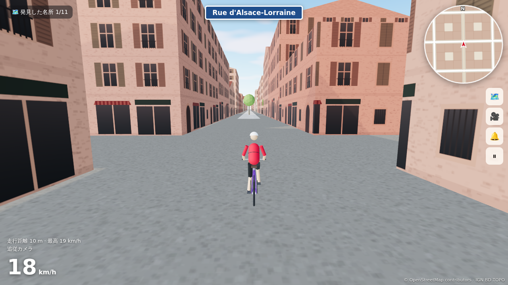
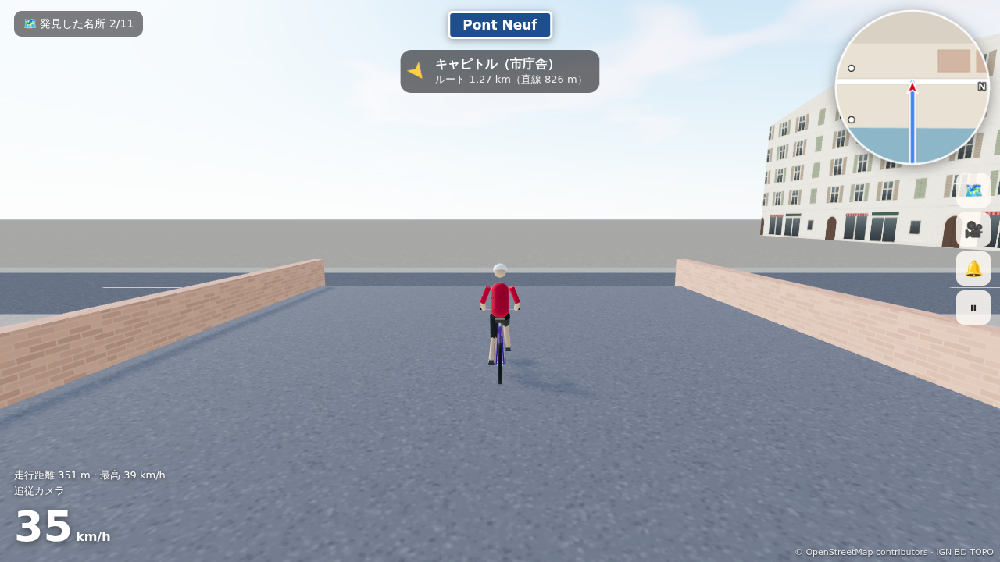
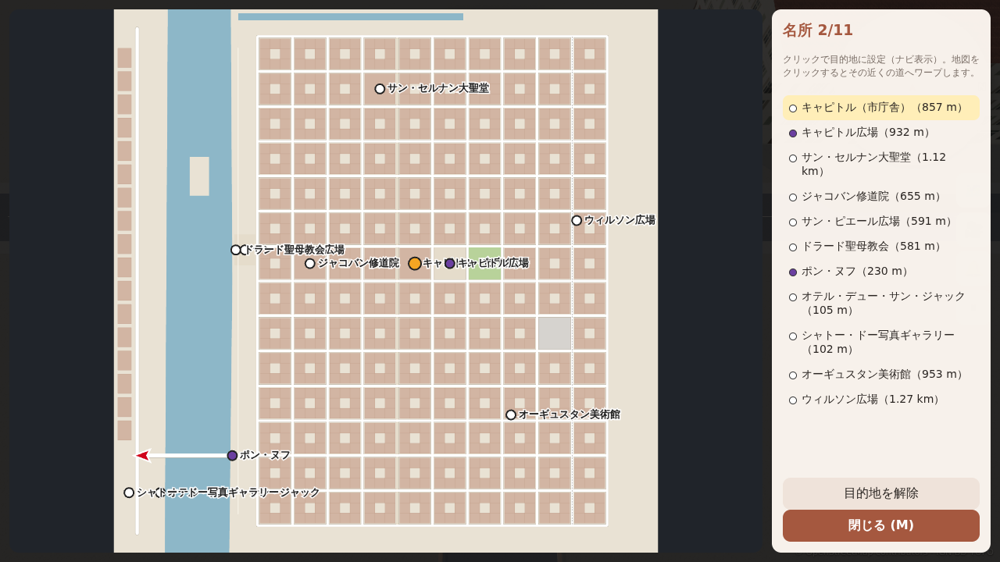

# Toulouse à vélo — トゥールーズ自転車散歩

実在のフランス・トゥールーズの街を 3D で再現し、自転車で自由に走り回れるブラウザゲームです。
建物・通り・川・橋・公園・街路樹は、すべて実際の地図データ（OpenStreetMap と IGN BD TOPO）から自動生成しています。

|  |  |
| --- | --- |
|  | ※ 画像は開発環境（地図サーバーに接続できない環境）で、テスト用の**合成データ**（格子状の街）を使って撮影したものです。実際にプレイすると、本物のトゥールーズの通りと建物が生成されます。 |

## 遊び方

| 操作 | キーボード | ゲームパッド | スマホ |
| --- | --- | --- | --- |
| こぐ | `W` / `↑` | RT / A | 「こぐ」 |
| ブレーキ（止まっているときは後退） | `S` / `↓` | LT / B | 「ブレーキ」 |
| ハンドル | `A` `D` / `←` `→` | 左スティック | ◀ ▶ |
| 立ちこぎ（加速） | `Shift` | RB | — |
| ベル | `Space` | X | 🔔 |
| カメラ切替（追従 / 一人称 / 上空） | `C` | Y | 🎥 |
| 地図・目的地選択・ワープ | `M` / `Tab` | Back | 🗺️ |
| 道路に戻る | `R` | — | — |
| ポーズ | `Esc` / `P` | Start | ⏸ |

- **自由走行**: 街を走って名所（キャピトル、サン・セルナン大聖堂、ポン・ヌフ、ミディ運河など 18 か所）を発見します。地図で名所を選ぶと、実際の道路網でルートを計算してナビします。
- **名所めぐりタイムアタック**: キャピトル広場をスタートし、名所を順番に回ってタイムを競います（自己ベストを保存）。
- 画面上部には今走っている**実際の通りの名前**が表示されます。

## 「正確な再現」のしくみ

| 要素 | データ | 再現方法 |
| --- | --- | --- |
| 建物の形 | OpenStreetMap（フランスの地籍図由来で非常に正確） | 外形を押し出して 3D 化。中庭（マルチポリゴンの穴）、`building:part`（鐘楼など）にも対応 |
| 建物の高さ | ① OSM の `height` → ② **IGN BD TOPO の実測の高さ** → ③ OSM の階数 → ④ 推定 | IGN のデータは航空写真測量による実測値。OSM の建物と位置で照合して割り当て |
| 屋根 | OSM の `roof:shape` | 切妻・寄棟・方形・陸屋根。タグがない四角形の建物は、トゥールーズに多い緩勾配の瓦屋根（切妻）に |
| 壁の色 | OSM の `building:colour` / `building:material` | タグがなければ「ばら色の街」らしいレンガ色と漆喰色から建物ごとに決定 |
| 道路 | OSM の `highway` | 種類ごとの幅（`width`・`lanes` があればその値）で、車道・歩道・歩行者天国（石畳）・自転車道を描き分け |
| 川・運河 | OSM の水域ポリゴン | ガロンヌ川は約 6 m 下を流れ、レンガの河岸の壁で囲まれる。橋（`bridge=yes`）だけ渡れる |
| 公園・木 | OSM の `leisure` / `landuse` / `natural=tree` | 登録された木はその位置に。木の少ない公園には木を補う |

ゲーム中に `Esc` でポーズすると、建物の高さが「IGN 実測 / OSM / 推定」のどれから来たかの内訳が見られます。

### 既知の限界

- 地形（標高差）は再現していません。トゥールーズ中心部はほぼ平坦ですが、川の低い河岸道（ベルジュ）などは地上と同じ高さになります。
- 外観（窓・扉・瓦）は手続き的に作ったテクスチャで、実物の写真ではありません。ファサードの細部やモニュメントの装飾は再現されません。
- 自動車・歩行者はいません。一方通行も無視します（ゲームなので）。
- 再現の精度は OSM の登録状況に依存します。おかしな箇所は [OpenStreetMap](https://www.openstreetmap.org/) を直すと、次回のデータ取得から反映されます。

## 開発

```bash
cd toulouse-a-velo
npm install
npm run dev          # http://localhost:5173 で起動
```

初回起動時、ブラウザが Overpass API（OSM）と IGN Géoplateforme の WFS から地図データをダウンロードします（標準エリアで 20〜40 MB 程度、30 秒〜数分）。取得したデータは IndexedDB にキャッシュされ、2 回目以降はすぐに始まります。

### 地図データを同梱する（推奨）

```bash
npm run fetch-data           # 標準エリア → public/data/centre.json
npm run fetch-data -- all    # すべてのエリア
```

`public/data/` に保存されたデータがあれば、ゲームはそれを最初に使います（ダウンロード待ちなし・Overpass が混んでいても遊べる）。

### URL パラメータ

| パラメータ | 例 | 説明 |
| --- | --- | --- |
| `area` | `?area=light` | エリアを選んだ状態で開く（`centre` / `large` / `light`） |
| `lat` `lon` `r` | `?lat=43.5615&lon=1.4682&r=800` | 任意の地点を中心にする（トゥールーズ以外の街でも動きます） |
| `mode` | `?mode=tour` | タイムアタックを選んだ状態で開く |
| `autostart` | `?autostart=1` | タイトル画面を飛ばして開始 |

### テスト

```bash
npm test                         # 単体テスト（座標変換・OSM 解析・ルート探索・当たり判定）
npm run build && npm run test:e2e  # ブラウザでの通しテスト（Playwright）
```

E2E テストは地図サーバーへの通信を合成データ（`test/fixture.mjs`、トゥールーズ風の格子状の街）に差し替えて、読み込み → 走行 → 建物・川との衝突 → 橋 → 地図とナビ → タイムアタックを確認し、`test/output/` にスクリーンショットを保存します。

### 公開（GitHub Pages）

`.github/workflows/toulouse-a-velo.yml` が `main` ブランチへの push でビルドし、地図データを同梱して GitHub Pages に公開します。リポジトリの **Settings → Pages → Source** を **GitHub Actions** にしてください。

### ファイル構成

```
src/
  main.js            ゲーム全体（画面遷移・ループ・HUD）
  config.js          エリアのプリセット、名所、タイムアタックのコース
  geo.js             緯度経度 ↔ メートル座標、ポリゴン処理、空間グリッド
  data/              Overpass API・IGN WFS からの取得、IndexedDB キャッシュ
  world/parse.js     OSM → 建物・道路・水域・緑地・木（高さの決定もここ）
  world/buildings.js 建物メッシュ（壁・窓・屋根）
  world/ground.js    地面・道路・歩道・水面と河岸・橋
  world/trees.js     木（InstancedMesh）
  world/textures.js  手続き的テクスチャ（ファサード・瓦・石畳・水面）
  game/bike.js       自転車とライダーのモデル・物理
  game/collision.js  当たり判定（建物・木・川・エリア端）
  game/roadnet.js    道路ネットワーク（通りの名前・ルート探索 A*）
  game/landmarks.js  名所の位置合わせ・目的地の光の柱
  game/camera.js     カメラ
  ui/minimap.js      ミニマップと全体地図
scripts/fetch-data.mjs  地図データの事前取得
```

## ライセンス・クレジット

- コード: MIT
- 地図データ: © [OpenStreetMap contributors](https://www.openstreetmap.org/copyright)（ODbL 1.0）
- 建物の高さ: IGN BD TOPO®（[Licence Ouverte / Etalab 2.0](https://www.etalab.gouv.fr/licence-ouverte-open-licence/)）
- 3D 描画: [three.js](https://threejs.org/)
